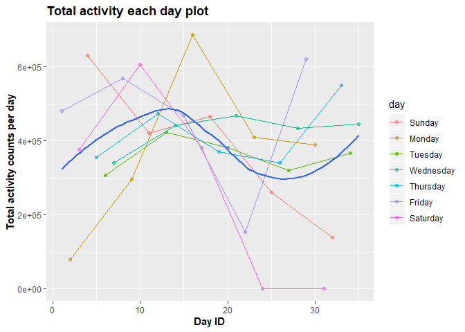

p8104\_hw3\_zz2603
================
Ziyi Zhao
10/7/2019

# Question 1

``` r
data("instacart")

## How many aisles are there, and which aisles are the most items ordered 
## from?
instacart %>% pull(aisle) %>% unique() %>% length()
```

    ## [1] 134

``` r
## or we can also do
pull(instacart,aisle_id) %>% max()
```

    ## [1] 134

``` r
## and for the aisle with most ordered products
instacart %>% 
  group_by(aisle,product_name) %>% 
  summarize(total_order=sum(order_number)) %>% 
  filter(min_rank(desc(total_order))<2) %>% 
  .[which.max(pull(.,total_order)),] %>% pull(aisle)
```

    ## [1] "fresh fruits"

``` r
## Make a plot that shows the number of items ordered in each aisle, limiting 
## this to aisles with more than 10000 items ordered. Arrange aisles sensibly,
## and organize your plot so others can read it.
instacart %>% 
  group_by(aisle) %>%
  summarize(total_order=sum(order_number)) %>% 
  filter(total_order>10000) %>% 
  ggplot(aes(x=aisle,y=total_order))+geom_point()+
  labs(
    x="name of aisle",
    y="number of ordered items",
    title = "number of items per aisle plot"
  )+
  theme(axis.text.x = element_text(angle = 90,hjust=1),
        axis.title = element_text(size = 25,face = "bold"),
        axis.text = element_text(size=12),
        plot.title = element_text(size=26,face = "bold"))
```

<!-- -->

``` r
## Make a table showing the three most popular items in each of the aisles 
## “baking ingredients”, “dog food care”, and “packaged vegetables fruits”. 
## Include the number of times each item is ordered in your table.
instacart %>% 
  filter(aisle=="baking ingredients"|aisle=="dog food care"|aisle=="packaged vegetables fruits") %>% 
  group_by(aisle,product_name) %>% 
  summarize(total_order=sum(order_number)) %>% 
  mutate(rank=min_rank(desc(total_order))) %>% 
  filter(rank<4) %>% arrange(desc(total_order)) %>% 
  knitr::kable()
```

| aisle                      | product\_name                                 | total\_order | rank |
| :------------------------- | :-------------------------------------------- | -----------: | ---: |
| packaged vegetables fruits | Organic Baby Spinach                          |       171301 |    1 |
| packaged vegetables fruits | Organic Raspberries                           |       113932 |    2 |
| packaged vegetables fruits | Organic Blueberries                           |        86765 |    3 |
| baking ingredients         | Light Brown Sugar                             |         8605 |    1 |
| baking ingredients         | Cane Sugar                                    |         6244 |    2 |
| baking ingredients         | Organic Vanilla Extract                       |         6003 |    3 |
| dog food care              | Standard Size Pet Waste bags                  |          675 |    1 |
| dog food care              | Beef Stew Canned Dog Food                     |          631 |    2 |
| dog food care              | Snack Sticks Chicken & Rice Recipe Dog Treats |          589 |    3 |

``` r
## Make a table showing the mean hour of the day at which Pink Lady Apples 
## and Coffee Ice Cream are ordered on each day of the week; format this 
## table for human readers (i.e. produce a 2 x 7 table).
mean_order_tbl <- instacart %>% 
  filter(
    product_name=="Pink Lady Apples"|product_name=="Coffee Ice Cream"
    ) %>% 
  group_by(product_name,order_dow) %>% 
  summarize(mean_order_hour_day=mean(order_hour_of_day)) %>% 
  pivot_wider(
    names_from = product_name,
    values_from = mean_order_hour_day,
  )

weeklist <- c("Sunday","Monday","Tuesday",
              "Wednesday","Thursday","Friday",
              "Saturday")

mean_order_tbl[,1] <- weeklist[pull(mean_order_tbl,order_dow)+1]

mean_order_tbl %>% knitr::kable()
```

| order\_dow | Coffee Ice Cream | Pink Lady Apples |
| :--------- | ---------------: | ---------------: |
| Sunday     |         13.77419 |         13.44118 |
| Monday     |         14.31579 |         11.36000 |
| Tuesday    |         15.38095 |         11.70213 |
| Wednesday  |         15.31818 |         14.25000 |
| Thursday   |         15.21739 |         11.55172 |
| Friday     |         12.26316 |         12.78431 |
| Saturday   |         13.83333 |         11.93750 |

## short description of the dataset

We loaded the data *instacart* from the P8105.datasets. There are
1384617 rows and 15 columns in the dataset. There are 15 variables in
the dataset. The key variables included *user\_id*,
*add\_to\_cart\_order*, *order\_number*, *order\_dow*, *product\_name*,
*aisle* and *department*, because these information can help us quickly
figure out which product or categaories are the most items ordered by
customers (means popular). We can also assess other information from
these variables, such as the time customer spent on orders and date
customer picked to order.

## description for following questions:

  - there are 134 aisles in total. The most items are ordered from fresh
    fruits aisle.
  - the above plot show the number of items ordered per aisle that are
    greater than 10000. After the filteration, 122 aisles are left. The
    fresh fruits aisle has the highest number of ordered items.
  - the tables show the three most popular products in aisle “baking
    ingredients”, “dog food care”, and “packaged vegetables fruits”.
    Organic Baby Spinach, Organic Raspberries and Organic Blueberries
    are the three most popular product in asile packaged vegetables
    fruits; Light Brown Sugar, Cane Sugar and Organic Vanilla Extract
    are the most popular products in aisle baking ingredients; Standard
    Size Pet Waste bags, Beef Stew Canned Dog Food and Snack Sticks
    Chicken & Rice Recipe Dog Treats are the three most popular products
    in aisle dog food care.
  - the table above show the mean hour per day for products Coffee Ice
    Cream and Pink Lady Apples. It seems that people on Wednesday will
    spent relatively more times in ordering ice cream and apples than
    weekends on average.

# Problem 2

``` r
data("brfss_smart2010")
tidybrftbl <- brfss_smart2010 %>% 
  janitor::clean_names() %>% 
  filter(topic=="Overall Health") %>% 
  filter(response=="Excellent"|response=="Very good"|
           response=="Good"|response=="Fair"|
           response=="Poor") %>% 
  mutate(response=forcats::fct_relevel(response,
                                       c("Poor",
                                         "Fair",
                                         "Good",
                                         "Very good",
                                         "Excellent")))

## In 2002, which states were observed at 7 or more locations? What about in 
## 2010?
loctbl_year <- tidybrftbl %>% 
  filter(year==2010|year==2002) %>% 
  group_by(year,locationabbr,locationdesc) %>% 
  summarize(n=n()) %>% 
  count(locationabbr,name = "num_loc") %>% 
  filter(num_loc>6)
loctbl_year
```

    ## # A tibble: 20 x 3
    ## # Groups:   year, locationabbr [20]
    ##     year locationabbr num_loc
    ##    <int> <chr>          <int>
    ##  1  2002 CT                 7
    ##  2  2002 FL                 7
    ##  3  2002 MA                 8
    ##  4  2002 NC                 7
    ##  5  2002 NJ                 8
    ##  6  2002 PA                10
    ##  7  2010 CA                12
    ##  8  2010 CO                 7
    ##  9  2010 FL                41
    ## 10  2010 MA                 9
    ## 11  2010 MD                12
    ## 12  2010 NC                12
    ## 13  2010 NE                10
    ## 14  2010 NJ                19
    ## 15  2010 NY                 9
    ## 16  2010 OH                 8
    ## 17  2010 PA                 7
    ## 18  2010 SC                 7
    ## 19  2010 TX                16
    ## 20  2010 WA                10

``` r
## in 2002, the states observed with more than or equal to 7 locations
loctbl_year %>% 
  filter(year==2002) %>% 
  pull(locationabbr)
```

    ## [1] "CT" "FL" "MA" "NC" "NJ" "PA"

``` r
## in 2010, the states observed with more than or equal to 7 location
loctbl_year %>% 
  filter(year==2010) %>% 
  pull(locationabbr)
```

    ##  [1] "CA" "CO" "FL" "MA" "MD" "NC" "NE" "NJ" "NY" "OH" "PA" "SC" "TX" "WA"

``` r
## Construct a dataset that is limited to Excellent responses, and contains, 
## year, state, and a variable that averages the data_value across locations 
## within a state. Make a “spaghetti” plot of this average value over time 
## within a state (that is, make a plot showing a line for each state across 
## years – the geom_line geometry and group aesthetic will help). 
exctbl <- tidybrftbl %>% 
  filter(response=="Excellent") %>% 
  group_by(year,locationabbr,locationdesc) %>% 
  summarize(mean_value=mean(data_value,na.rm = TRUE))

ggplot(exctbl,aes(x=year,y=mean_value))+
  geom_line(aes(group=locationabbr))+
  labs(
    x="Year",
    y="Mean of data values",
    title = "Mean of data values for each state across years"
  )+
  theme(
    axis.title = element_text(face = "bold"),
    plot.title = element_text(face = "bold")
  )
```


``` r
## Make a two-panel plot showing, for the years 2006, and 2010, distribution 
## of data_value for responses (“Poor” to “Excellent”) among locations in NY 
## State.
tidybrftbl %>% 
  filter(year==2006|year==2010&locationabbr=="NY") %>% 
  group_by(locationdesc,response) %>% 
  ggplot(aes(x=response,y=data_value))+
  geom_violin(aes(fill=response),color="blue",alpha=0.5)+
  stat_summary(fun.y = median,geom = "point")+
  labs(
    x="Response",
    y="Data values",
    title="data values vs. responses in 2006 and 2010"
  )+
  theme(
    axis.text.x = element_text(angle = 90,hjust = 1),
    axis.title = element_text(face = "bold"),
    plot.title = element_text(face = "bold"))+
  facet_grid(.~year)
```

    ## Warning: Removed 4 rows containing non-finite values (stat_ydensity).

    ## Warning: Removed 4 rows containing non-finite values (stat_summary).


## short description for each question

  - The abbreviation of states with equal to or more than 7 states are
    shown above.The number of states in 2010 is more than number of
    states in 2002.
  - The plot about average data values among “Excellent” response over
    time within a state is shown above. Although plot seems quite messy
    with great volatity, the general trend of mean values for each state
    decrease slightly from 2002 to 2010.
  - The violin plot about the distribution of data values for responses
    among location in NY states in 2006 and 2010 is shown above. In two
    years, the general trend of response looks similar. The “Very good”
    response is always the highest and “Poor” response is the lowest.
    The distribution of data values in 2010 was generally skewed to left
    for each response (except “Poor”); the distribution of data values
    in 2002 was generally seems in balanced for each response (except
    “Poor”).

# Problem 3

``` r
accdata <- read_csv("./data/accel_data.csv")
```

    ## Parsed with column specification:
    ## cols(
    ##   .default = col_double(),
    ##   day = col_character()
    ## )

    ## See spec(...) for full column specifications.

``` r
tidyacc <- accdata %>% janitor::clean_names() %>% 
  pivot_longer(
    activity_1:activity_1440,
    names_to = "min",
    names_prefix = "activity_",
    values_to = "activity_counts")

day <- pull(tidyacc,day) %>% 
  factor(levels = c("Sunday","Monday","Tuesday",
                    "Wednesday","Thursday","Friday",
                    "Saturday"))

tidyacc[,3] <- day

tidyacc <- tidyacc %>% mutate(weekday=recode(day,
                                  "Monday"="Weekday",
                                  "Tuesday"="weekday",
                                  "Wednesday"="Weekday",
                                  "Thursday"="Weekday",
                                  "Friday"="Weekday",
                                  "Saturday"="Weekend",
                                  "Sunday"="Weekend"))
head(tidyacc,n=20)
```

    ## # A tibble: 20 x 6
    ##     week day_id day    min   activity_counts weekday
    ##    <dbl>  <dbl> <fct>  <chr>           <dbl> <fct>  
    ##  1     1      1 Friday 1                88.4 Weekday
    ##  2     1      1 Friday 2                82.2 Weekday
    ##  3     1      1 Friday 3                64.4 Weekday
    ##  4     1      1 Friday 4                70.0 Weekday
    ##  5     1      1 Friday 5                75.0 Weekday
    ##  6     1      1 Friday 6                66.3 Weekday
    ##  7     1      1 Friday 7                53.8 Weekday
    ##  8     1      1 Friday 8                47.8 Weekday
    ##  9     1      1 Friday 9                55.5 Weekday
    ## 10     1      1 Friday 10               43.0 Weekday
    ## 11     1      1 Friday 11               46.8 Weekday
    ## 12     1      1 Friday 12               25.5 Weekday
    ## 13     1      1 Friday 13               19.0 Weekday
    ## 14     1      1 Friday 14               31.1 Weekday
    ## 15     1      1 Friday 15               22.9 Weekday
    ## 16     1      1 Friday 16               24.8 Weekday
    ## 17     1      1 Friday 17               51.0 Weekday
    ## 18     1      1 Friday 18               35.5 Weekday
    ## 19     1      1 Friday 19               41.0 Weekday
    ## 20     1      1 Friday 20               59.0 Weekday

## description of dataset

There are 50400 rows and 6 columns in the tidied dataset. We tried to
re-combine all observations of activity counts for each minute in one
column. The whole study test for 5 weeks (35 days in total).Since we
counted for each minute, we have 50400 observations.

``` r
tidyacc %>% 
  group_by(day_id) %>% 
  summarize(total_counts = sum(activity_counts)) %>% 
  knitr::kable()
```

| day\_id | total\_counts |
| ------: | ------------: |
|       1 |     480542.62 |
|       2 |      78828.07 |
|       3 |     376254.00 |
|       4 |     631105.00 |
|       5 |     355923.64 |
|       6 |     307094.24 |
|       7 |     340115.01 |
|       8 |     568839.00 |
|       9 |     295431.00 |
|      10 |     607175.00 |
|      11 |     422018.00 |
|      12 |     474048.00 |
|      13 |     423245.00 |
|      14 |     440962.00 |
|      15 |     467420.00 |
|      16 |     685910.00 |
|      17 |     382928.00 |
|      18 |     467052.00 |
|      19 |     371230.00 |
|      20 |     381507.00 |
|      21 |     468869.00 |
|      22 |     154049.00 |
|      23 |     409450.00 |
|      24 |       1440.00 |
|      25 |     260617.00 |
|      26 |     340291.00 |
|      27 |     319568.00 |
|      28 |     434460.00 |
|      29 |     620860.00 |
|      30 |     389080.00 |
|      31 |       1440.00 |
|      32 |     138421.00 |
|      33 |     549658.00 |
|      34 |     367824.00 |
|      35 |     445366.00 |

I don’t think the trend is apparrent from the table reading. It would be
better if we can create a plot to see the general trend.

``` r
tidyacc %>% 
  group_by(day_id,day) %>% 
  summarize(total_counts=sum(activity_counts)) %>% 
  ggplot(aes(x=day_id,y=total_counts))+
  geom_point(aes(color=day),alpha=0.6)+
  geom_line(aes(color=day))+
  geom_smooth(se=FALSE)+
  labs(
    x="Day ID",
    y="Total activity counts per day",
    title = "Total activity each day plot"
  )+
  theme(
    axis.title = element_text(face="bold"),
    plot.title = element_text(face = "bold")
  )
```

    ## `geom_smooth()` using method = 'loess' and formula 'y ~ x'



I failed to see any clear pattern between total activity and date. The
potential seasonality is the only thing we can observed from the plots
but still need more time to figure it out. There is no clear increasing
or decreasing trends in the plot. Since the points of each day of week
are so scattered, we have to connect them together to see the
trends.However, the votality among each day of week is so high that we
cannot simply conclude their patterns. The the total activity counts on
Thursday, Tuesday and Wednesday did not change too much and tended to be
flat. The other 4 days had greater votality. The counts on Monday
increase in the three weeks but drop in the last two; the counts on
Sunday keep dropping; counts on Friday did not have clear pattern;
counts on Saturday also increase at first but drop in the last several
weeks.
